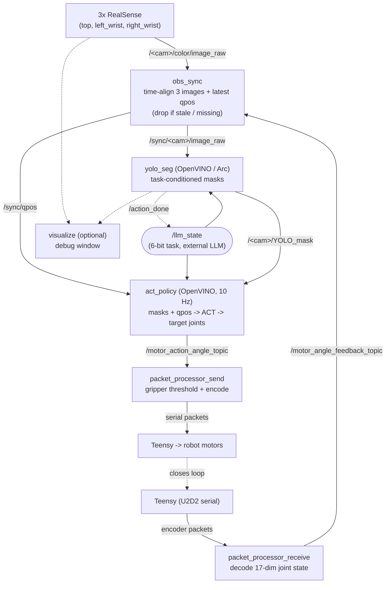

# Node Flow Pipeline

Segmentation-guided grasping ROS 2 pipeline (OpenVINO deployment on Intel AI PC).

## Flow chart



```txt
 ┌─────────────────────────────────────────────────────────────────────┐
  │                          SENSING                                     │
  └─────────────────────────────────────────────────────────────────────┘

    3x RealSense                          Teensy (U2D2 serial)
    (top, left_wrist, right_wrist)                │
          │                                       │ encoder packets
          │ /<cam>/color/image_raw                ▼
          │                          ┌──────────────────────────────┐
          │                          │ packet_processor_receive     │
          │                          │  decode 17-dim joint state   │
          │                          └──────────────┬───────────────┘
          │                                         │ /motor_angle_feedback_topic
          ▼                                         ▼
    ┌──────────────────────────────────────────────────────────┐
    │ obs_sync                                                  │
    │  time-align 3 images + latest qpos (drop if stale/none)  │
    └───────┬──────────────────────────────────┬───────────────┘
            │ /sync/<cam>/image_raw             │ /sync/qpos
            │                                   │
            ▼                                   │
    ┌───────────────────────────┐              │
    │ yolo_seg  (OpenVINO/Arc)  │              │
    │  task-conditioned masks   │◄──── /llm_state (6-bit task, external)
    └───────┬───────────────────┘              │
            │ /<cam>/YOLO_mask                  │
            │                                   │
            ▼                                   ▼
    ┌──────────────────────────────────────────────────────────┐
    │ act_policy  (OpenVINO, 10 Hz)                            │
    │  observation (masks + qpos) -> ACT -> target joints     │◄── /llm_state
    └───────────────────────┬──────────────────────────────────┘
                            │ /motor_action_angle_topic
                            ▼
  ┌─────────────────────────────────────────────────────────────────────┐
  │                          ACTING                                      │
  └─────────────────────────────────────────────────────────────────────┘

    ┌──────────────────────────────┐
    │ packet_processor_send        │
    │  gripper threshold + encode  │
    └───────────────┬──────────────┘
                    │ serial packets
                    ▼
                Teensy ──► robot motors
                    │
                    └──► (loop back via packet_processor_receive)

    visualize  (optional): subscribes /<cam>/image_raw + /<cam>/YOLO_mask -> debug window

```

## Node summary

| Node | In | Out |
|---|---|---|
| `packet_processor_receive` | serial (Teensy) | `/motor_angle_feedback_topic` (qpos) |
| `obs_sync` | 3 images + qpos | `/sync/<cam>/image_raw`, `/sync/qpos` |
| `yolo_seg` | synced images + `/llm_state` | `/<cam>/YOLO_mask`, `/action_done` |
| `act_policy` | masks + `/sync/qpos` + `/llm_state` | `/motor_action_angle_topic` |
| `packet_processor_send` | `/motor_action_angle_topic` | serial (Teensy) |
| `visualize` | images + masks | debug window (optional) |

## Notes

- **Closed loop:** motors move → encoders change → `packet_processor_receive` feeds the
  new qpos back into `obs_sync`.
- **Task conditioning:** the external `/llm_state` (from an LLM task planner) conditions
  both `yolo_seg` and `act_policy` on the current subtask; `yolo_seg` publishes
  `/action_done` back when the target lands in the basket.
- **Rates:** the whole chain runs at **10 Hz** to match data-collection frequency.
  `obs_sync` drops any observation whose qpos is missing or older than `encoder_timeout`,
  so nothing downstream sees images paired with a stale joint state.
